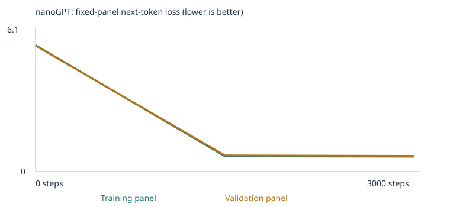
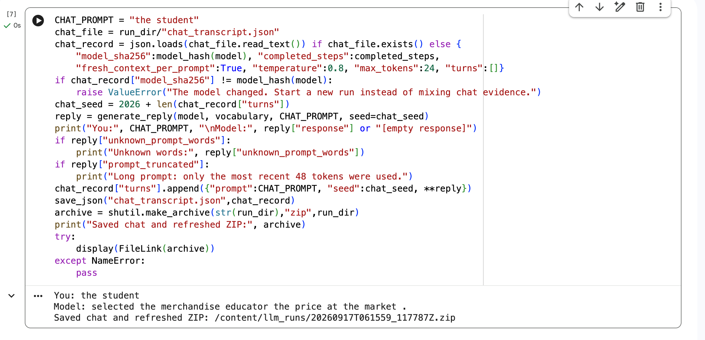
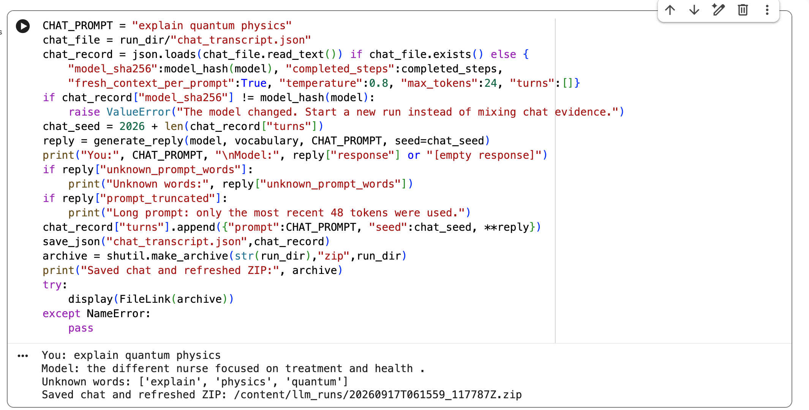

# Assignment 3: Training and Inspecting a Tiny Language Model

I trained the supplied word-token nanoGPT from scratch in two CPU experiments. The first used the classroom corpus. The second added synthetic teaching sentences about opposites and spatial relations. Both completed 3,000 steps with an initial learning rate of 0.001.

The trained models answered 20/48 and 25/48 fixed evals respectively. The extension increased vocabulary coverage, but all three opposite-word cases remained incorrect. This experiment shows that adding words to a vocabulary does not guarantee successful prediction of their relationships.

## Experiments, corpus and prediction

The classroom corpus is the starter repository's synthetic English teaching corpus, covering shopping/business, finance, food, transport, software, health and education. No external files were used in the starter run. The extension files were drafted with Codex assistance: [opposites.txt](corpus/opposites.txt), 195 unique passages, and [spatial_relations.txt](corpus/spatial_relations.txt), 582 unique passages. These are synthetic examples intended for sharing; no private documents or PDF extraction were involved. I chose these categories because contrasts and positions are concrete and their predictions can be inspected. The material teaches broad relationships using varied objects and names rather than copying test stories or answer lists.

My starter prediction was that samples would become more like classroom sentences, validation loss would decrease, and unfamiliar wording or missing vocabulary would remain difficult. My extension prediction was that coverage would improve, while correct relationship predictions were not guaranteed. Both predictions were written before the respective runs and are visible in the notebooks. The prediction mentioned inspecting “student”; the notebook's saved numerical probe actually inspected “customer.” I report that actual probe below and use “student” only as a chat example.

| Setting | Starter | Expanded |
|---|---:|---:|
| Completed steps | 3000 | 3000 |
| Initial learning rate | 0.001 | 0.001 |
| Seed | 42 | 42 |
| Vocabulary size | 136 | 263 |
| Parameters | 111872 | 120000 |
| Training passages | 4132 | 4832 |
| Validation passages | 460 | 537 |
| Training unknown-token rate | 0.0 | 0.0 |
| Validation unknown-token rate | 0.0 | 0.0 |
| Training-loop time (seconds) | 60.84 | 55.02 |

Both runs used Colab CPU, Python 3.13.15 and PyTorch 2.11.0+cpu, with two transformer blocks, four heads, 64-dimensional embeddings, a 48-token context and batch size 32. Time above is the recorded training loop, not total notebook runtime. Neither run was interrupted.

Text is normalized and deduplicated before a 90/10 passage split. Validation passages do not update weights. Vocabulary is built only from training passages. The split, fixed loss panels, seed and baseline generation settings stay fixed within each run; adding data changes the passage sets, vocabulary and parameter count across runs. Even with the same seed, this is not an identical random initialization comparison across differently sized models.

## Fixed eval results

All 48 cases were run unchanged before and after each experiment. The evaluator sends only the prefix to the model. It ranks four candidate next words after inference; correct highest-probability choices score 1, errors and ties score 0. Free continuations are saved separately and are not graded by that choice score. Cases containing unknown prompt or choice words are unscorable and count as zero in the all-case rate.

| Experiment / stage | Correct / all 48 | All-case success | Scorable cases | Scorable accuracy | Coverage | Complete results |
|---|---:|---:|---:|---:|---:|---|
| starter / untrained | 9/48 | 18.75% | 24/48 | 37.50% | 50.00% | [JSON](results/starter/language_evals/untrained/eval_results.json), [CSV](results/starter/language_evals/untrained/eval_results.csv), [summary](results/starter/language_evals/untrained/eval_summary.json) |
| starter / final | 20/48 | 41.67% | 24/48 | 83.33% | 50.00% | [JSON](results/starter/language_evals/final/eval_results.json), [CSV](results/starter/language_evals/final/eval_results.csv), [summary](results/starter/language_evals/final/eval_summary.json) |
| expanded / untrained | 5/48 | 10.42% | 29/48 | 17.24% | 60.42% | [JSON](results/expanded/language_evals/untrained/eval_results.json), [CSV](results/expanded/language_evals/untrained/eval_results.csv), [summary](results/expanded/language_evals/untrained/eval_summary.json) |
| expanded / final | 25/48 | 52.08% | 29/48 | 86.21% | 60.42% | [JSON](results/expanded/language_evals/final/eval_results.json), [CSV](results/expanded/language_evals/final/eval_results.csv), [summary](results/expanded/language_evals/final/eval_summary.json) |

| Group / category | Starter trained | Expanded trained | Expanded scorable |
|---|---:|---:|---:|
| starter_patterns | 16/16 | 16/16 | 16/16 |
| starter_transfer | 4/8 | 8/8 | 8/8 |
| extend_corpus | 0/24 | 1/24 | 5/24 |
| categories_and_analogies | 0/3 | 0/3 | 0/3 |
| domain_context | 8/8 | 8/8 | 8/8 |
| domain_place | 8/8 | 8/8 | 8/8 |
| everyday_knowledge | 0/3 | 0/3 | 0/3 |
| grammar | 0/3 | 0/3 | 0/3 |
| negation | 0/3 | 0/3 | 0/3 |
| new_wording | 4/8 | 8/8 | 8/8 |
| opposites | 0/3 | 0/3 | 3/3 |
| reference | 0/3 | 0/3 | 0/3 |
| sequence | 0/3 | 0/3 | 0/3 |
| spatial_relations | 0/3 | 1/3 | 2/3 |

Coverage increased from 24 to 29 scorable cases. Three opposite-word cases and two spatial cases became scorable. The expanded trained model retained 16/16 starter-pattern successes and scored 8/8 on new wording, versus 4/8 in the starter. This measured improvement does not isolate a unique causal mechanism: the training data, vocabulary, parameter count and random draws changed.

All three opposite-word cases became scorable but remained wrong: the model selected “warm” for hot, “quiet” for empty, and “late” for noisy. One possible explanation is that the descriptive teaching patterns did not transfer to the test wording. These results do not show that the model mastered opposites.

The spatial model selected “below” correctly for the above/below case, but its unrestricted continuation was “at the soft to .” It selected “shelf” instead of “book” in the containment case. The horizontal case remained unscorable because “ball” and “box” were absent from the vocabulary. My extension did not fully cover every needed word. A correct four-choice answer therefore does not guarantee fluent output or reliable spatial reasoning.

### Corpus separation

The eval suite, runner, results and chat logs are outside corpus/. Both runs excluded 160 classroom passages containing reserved eval prefixes before splitting or building the vocabulary. Both recorded the same suite hash: `1d7c503f34d88260d0ac897bc36b8ba621cccc1950aef47e7121e69b2c1c9e1d`. The extension preparation also checked all 48 normalized prefixes and found no exact matches in the teaching files. Exact matching is not a semantic leakage detector. Teaching files contain ordinary subject knowledge, without eval questions, paired reference answers, answer lists, scoring rules or eval outputs.

See [starter separation](results/starter/eval_separation.json), [expanded separation](results/expanded/eval_separation.json), [starter manifest](results/starter/corpus_manifest.json), [expanded manifest](results/expanded/corpus_manifest.json), and the unchanged [suite](evals/language_evals.json). These public tests guided the extension, so they are a development benchmark, not an unseen final generalization test.

## Loss and sample timeline

The losses below use fixed panels of 20 training and 20 validation passages per experiment, averaged over non-padding next-token targets. They are estimates, not full-corpus loss. Validation uses the same sentence templates as training, so lower loss does not demonstrate generalization to unseen domains or templates. Loss values across different corpora and vocabularies are not directly comparable as a ranking.

### Starter


| Step | Training panel loss | Validation panel loss |
|---|---:|---:|
| 0 | 4.926252 | 4.927548 |
| 1500 | 0.682139 | 0.718243 |
| 3000 | 0.678312 | 0.706136 |

**Step 0 — all saved samples:** [full file](results/starter/samples/step_0000.txt)

```text
pear professor bond doctor course harvest team physician journey checking buyer delivery traffic report the lecturer item offering and system <UNK> taste recommended mentioned bus question customer at mortgage nurse in instructor
kitchen purchase journey product question discussion journey service . nurse local
compared and purchase update mortgage question loan taste in market treatment learned another item bicycle product bicycle focused data and dentist recommended mango apple taxi bicycle delivery peach quality update student lesson
important hospital juice patient return recommended deposit tutor returned understand kitchen student design ordered hospital treatment important package traffic with yesterday investment important of mentioned store ordered mortgage nurse shopper the station
```

**Step 1500 — all saved samples:** [full file](results/starter/samples/step_1500.txt)

```text
our school has a question about the new educator and lesson .
a review of risk helped us understand the different deposit .
we learned about the important website during a discussion of data .
our school has a question about the different instructor and course .
```

**Step 3000 — all saved samples:** [full file](results/starter/samples/step_3000.txt)

```text
our school has a question about the new educator and lesson .
a review of risk helped us understand the different deposit .
the report about the nurse explains the health in detail .
the consumer compared the offering after checking the price .
```

### Expanded



| Step | Training panel loss | Validation panel loss |
|---|---:|---:|
| 0 | 5.590205 | 5.566098 |
| 1500 | 0.669713 | 0.715298 |
| 3000 | 0.656351 | 0.693968 |

**Step 0 — all saved samples:** [full file](results/expanded/samples/step_0000.txt)

```text
flower returned sets us sam desk comparing report light gate hard salad clean dry <BOS> doctor shoe it kitchen teacher omar was system tutor carries show stands beside purchase quiet surgeon reviewed
compared data hot pair feels orange quiet local <UNK> salad near is report is round shirt interest below heavy water visitor music application school detail ben explains so top right contains warm
compared wet apple learns mentioned different offering banana report instructor is consumer light about soft now is puts important inside inside flower closed customer below subscriber lecturer pair bus of show consumer
bottle compared data stone store shopper when a loud places key sets offering lamp feather so stands update bottom shopper lamp is patient subscriber credit hospital near near sits deposit fruit as
```

**Step 1500 — all saved samples:** [full file](results/expanded/samples/step_1500.txt)

```text
the important train was mentioned in the traffic report yesterday .
we learned about the new software during a discussion of data .
today the market focused on delivery and the new offering .
a review of purchase helped us understand the important consumer .
```

**Step 3000 — all saved samples:** [full file](results/expanded/samples/step_3000.txt)

```text
the important train was mentioned in the travel report yesterday .
we learned about the new software during a discussion of data .
today the market focused on delivery and the new offering .
a review of purchase helped us understand the important consumer .
```

Both experiments changed from unrelated word sequences into mostly classroom-like sentences. The halfway and final outputs often share patterns, and not every visible sample improves. I keep every saved sample, including garbled untrained strings.

## Following one word through the network

Tokens are the words and punctuation produced by the classroom tokenizer, plus UNK, BOS and EOS. IDs are arbitrary vocabulary indexes, not meanings. In the starter vocabulary, “customer” has ID 28. Looking up row 28 retrieves its 64-number embedding, which is a learned model parameter.

The tokenizer's saved example is `today the school focused on lesson and the local professor .`. Including BOS and EOS, its IDs are `[1, 121, 118, 101, 42, 74, 61, 7, 118, 63, 88, 3, 2]`. Input and target sequences are shifted one token: the model predicts each next token from earlier context. See [tokenization](results/starter/tokenization.json) and [inspection](results/starter/inspection.json).

### Customer embedding before and after

All 64 coordinates are included below (rounded to six decimals); the linked inspection stores full precision. No coordinate is a named concept.

**embedding_before:**

```text
-0.057592, -0.004810, 0.042632, 0.019339, 0.015643, -0.028824, 0.025609, 0.000052
0.024707, 0.020692, 0.007369, -0.033090, -0.053548, -0.005743, -0.024167, -0.014716
0.004686, -0.010454, -0.008381, -0.018259, -0.020134, 0.005099, -0.010917, -0.012633
0.028390, -0.002631, -0.004072, 0.013642, -0.009892, -0.016718, 0.001906, -0.001454
0.016027, -0.005675, -0.000672, -0.001291, -0.007319, -0.000931, 0.001508, -0.004977
-0.028987, 0.018093, -0.007348, -0.005440, 0.015641, -0.004544, 0.041568, 0.052355
0.022643, -0.015414, -0.025121, -0.006797, 0.029353, -0.002534, 0.029801, -0.022797
-0.030238, 0.006437, 0.050491, 0.007491, -0.010723, 0.024737, -0.014469, 0.013236
```

**embedding_after:**

```text
0.036630, -0.018219, 0.133030, 0.105951, 0.063015, 0.018913, 0.152302, 0.092909
-0.063219, -0.017256, 0.034096, -0.047387, -0.064554, -0.086587, -0.144992, -0.035883
-0.156909, -0.150273, -0.007623, -0.070745, -0.093015, 0.009107, -0.064810, 0.017522
0.003923, -0.062456, 0.112520, -0.064326, 0.052046, -0.156674, -0.070617, 0.061678
-0.031770, 0.141396, 0.091311, 0.056472, 0.019609, -0.134837, 0.122285, -0.033833
0.118740, 0.004577, -0.134432, 0.052943, -0.037597, -0.103121, 0.020273, 0.038116
-0.019841, -0.150737, 0.030281, -0.120554, 0.016618, 0.077755, 0.118088, 0.055737
0.093361, 0.002623, 0.037057, 0.075633, 0.118519, 0.014377, 0.091289, -0.074610
```

### One actual gradient and update

For customer embedding coordinate 0, the first saved update was:

| Quantity | Actual value |
|---|---:|
| before | -0.0575919151306152 |
| gradient | 0.000692586530931294 |
| learning_rate | 1e-05 |
| after | -0.0576019063591957 |

The positive gradient describes how loss responds locally to this parameter. AdamW used gradients, moment estimates and weight decay to update it; this is not a plain `weight − learning_rate × gradient` calculation. The first update's effective learning rate was 0.00001 because of warmup, while the configured initial/peak rate was 0.001. After all 3,000 updates, this coordinate reached 0.036629699. Other parameters also changed, so the prediction change cannot be attributed to this coordinate alone.

The network uses weighted transformations, LayerNorm, GELU, residual connections and causal attention to produce next-token logits. Softmax turns logits into probabilities; next-token cross-entropy measures prediction error. Backpropagation computes gradients, and AdamW adjusts parameters. Repetition changes both the embeddings and the rest of the network.

### Next-token probabilities and attention

For the fixed prefix `the customer`, selected starter probabilities changed as follows:

| Next token | Before | After |
|---|---:|---:|
| compared | 0.006207 | 0.159660 |
| selected | 0.007849 | 0.163443 |
| reviewed | 0.007111 | 0.178248 |
| ordered | 0.006236 | 0.168474 |
| customer | 0.016007 | 0.000104 |

Probabilities became more concentrated on verbs that fit the taught sentence contexts. Generation samples from the distribution, appends the selected token, and repeats until termination or the length limit.

For the inspected first-head attention over BOS, “the”, and “customer”, the final position had weights `[0.485141, 0.422999, 0.091860]`. These weights illustrate how that head combines the available positions. Earlier rows assign zero weight to future positions. One attention head is not a complete explanation of the model, and these weights do not establish human-like understanding.

## Temperature comparison

The notebook generated samples at 0.3, 0.8 and 1.2 using the same starting token and sampling seed for each comparison. Temperature changes sampling probabilities during inference, without weight updates. Lower values sharpen probabilities; higher values flatten them. This does not guarantee every high-temperature sample differs or is worse.

**Starter — all recorded samples:** [temperature_comparison.json](results/starter/temperature_comparison.json)

Temperature 0.3:

```text
our school has a question about the new educator and lesson .
a review of risk helped us understand the different investment .
the report about the nurse explains the health in detail .
the local consumer was mentioned in the purchase report yesterday .
```

Temperature 0.8:

```text
our school has a question about the new educator and lesson .
a review of risk helped us understand the different deposit .
the report about the nurse explains the health in detail .
the consumer compared the offering after checking the price .
```

Temperature 1.2:

```text
our school has a question about the new educator and lesson .
a review of risk helped us understand the different deposit .
the report about the nurse explains the health in detail .
the consumer compared the offering after checking the price .
```

**Expanded — all recorded samples:** [temperature_comparison.json](results/expanded/temperature_comparison.json)

Temperature 0.3:

```text
the important train was mentioned in the travel report yesterday .
the report about the deposit explains the interest in detail .
the report about the buyer explains the support in detail .
the new physician was mentioned in the care report yesterday .
```

Temperature 0.8:

```text
the important train was mentioned in the travel report yesterday .
we learned about the new software during a discussion of data .
today the market focused on delivery and the new offering .
a review of purchase helped us understand the important consumer .
```

Temperature 1.2:

```text
flower subscriber sets the flower on the jar on the left .
we learned about the important software during a discussion of data .
a review of treatment helped us understand the important dentist .
nora places the photo above the drawer so the drawer sits below the photo .
```

In the starter run, the saved 0.8 and 1.2 samples were identical. At 0.3, one sample used “investment” instead of “deposit”; another used a different consumer sentence pattern. The observed comparison is modest, not evidence that temperature necessarily creates dramatic changes.

## Real chat interactions and limitations

The provided [chat.py](chat.py) and notebook section 10 generate replies from the trained nanoGPT, without another model API, canned answers or retraining. Each prompt starts fresh. The context is 48 tokens; longer prompts keep only the most recent context. Unknown words are reported and mapped to UNK. This model continues text and is not instruction-trained.

The [starter transcript](results/starter/chat_transcript.json) contains three actual interactions with the starter model hash `700c31cd780c2b52c8c4d55d7b89b54a9fc7df7e2e5805643d066171ec52a904`:

| Prompt | Actual continuation | Observation |
|---|---|---|
| the customer | selected the item after checking the price . | A plausible classroom-style continuation. |
| the student | selected the merchandise educator the price at the market . | Mixed themes and broken syntax despite familiar words. |
| explain quantum physics | the different nurse focused on treatment and health . | All three prompt words were unknown; the reply did not answer the request. |





The expanded run also saved [one actual chat](results/expanded/chat_transcript.json): “explain quantum physics” produced “inside the health contrasting states .”, with the same unknown-word warning. This is not a general-purpose assistant.

## Run instructions

Install dependencies locally:

```sh
python -m pip install -r requirements.txt
```

Open [starter notebook](assignment3_starter.ipynb) or [expanded notebook](assignment3_expanded.ipynb) in Jupyter or Colab. The submission starter notebook uses the empty corpus_starter/ folder; the expanded notebook uses the two supplied TXT files in corpus/. The starter path was changed after execution solely to isolate the baseline from the extension files; saved outputs still document the original run with an empty corpus/ folder. In Colab, opening a notebook does not upload these files: run sections 1–2, upload the two teaching files into /content/corpus, then run from the top. Use CPU and the saved settings. Source helpers are provided, and the notebook verifies their pinned hashes. No model API key or pretrained weights are needed.

Submission copies retain original training and evaluation outputs. Temporary Colab download/upload and old-model recovery cells were removed so they do not reload an old model during Run All. No historical model results were replaced. Original notebook backups are retained locally outside the submission package.

Rerun evals using the included saved weights; choose new output folders:

```sh
python run_evals.py --model results/starter/model_untrained.pt --stage untrained --output reruns/starter-untrained
python run_evals.py --model results/starter/model.pt --output reruns/starter-final
python run_evals.py --model results/expanded/model_untrained.pt --stage untrained --output reruns/expanded-untrained
python run_evals.py --model results/expanded/model.pt --output reruns/expanded-final
```

Launch the chat loop (use a new transcript filename):

```sh
python chat.py --model results/starter/model.pt --transcript reruns/new-chat.json
```

Enter prompts and type `/quit` to exit. model.pt is the full network with its vocabulary; checkpoint.json is for the embedding viewer, not a substitute inference model. Open [embedding viewer](embedding-viewer.html) locally and load either run's checkpoint.json to inspect embeddings. The 3D PCA projection can distort distances; cosine neighbors use all 64 coordinates. The viewer is not a chat interface.

## Evidence index and verification status

Each results folder includes the full eval CSV/JSON files, samples, models and inspections. Config and vocabulary reports document the recorded hardware, coverage and choices.

**Starter:** [config.json](results/starter/config.json), [training.csv](results/starter/training.csv), [training_summary.json](results/starter/training_summary.json), [history.json](results/starter/history.json), [tokenization.json](results/starter/tokenization.json), [inspection.json](results/starter/inspection.json), [corpus_manifest.json](results/starter/corpus_manifest.json), [vocabulary_report.json](results/starter/vocabulary_report.json), [split.json](results/starter/split.json), [checkpoint.json](results/starter/checkpoint.json).

**Expanded:** [config.json](results/expanded/config.json), [training.csv](results/expanded/training.csv), [training_summary.json](results/expanded/training_summary.json), [history.json](results/expanded/history.json), [tokenization.json](results/expanded/tokenization.json), [inspection.json](results/expanded/inspection.json), [corpus_manifest.json](results/expanded/corpus_manifest.json), [vocabulary_report.json](results/expanded/vocabulary_report.json), [split.json](results/expanded/split.json), [checkpoint.json](results/expanded/checkpoint.json).

The four documented evaluation commands were verified in a separate local environment (Python 3.12, PyTorch 2.14.0, Apple Silicon CPU). All 192 cases ran, all four model hashes matched the original artifacts, and every choice, status and score agreed with the saved Colab results. The terminal chat command accepted three prompts, produced actual replies and saved its transcript. Verification outputs are separate from the original evidence; hardware/runtime changes can affect probabilities and sampled continuations. See [verification report](verification/verification_report.json), [terminal transcript](verification/terminal-chat.json), and [launch output](verification/chat-launch-output.txt). Notebook code syntax, absence of stored notebook errors, and normalized exact-prefix separation of both saved corpora were also checked. Full training was not repeated after the submission-copy edits. Public repository access and evidence links still need checking after upload; the repository has not yet been published or submitted.

## One limitation and next experiment

A key observed limitation is that better vocabulary coverage did not produce reliable relationship prediction: all three opposite cases failed even though their words were known. A next experiment would add more varied contrast explanations and spatial examples, including missing everyday object vocabulary, without copying or rewriting the existing test items. I would keep this public development suite fixed and also design separate untouched tests before training to assess transfer beyond the examples used to guide development.
